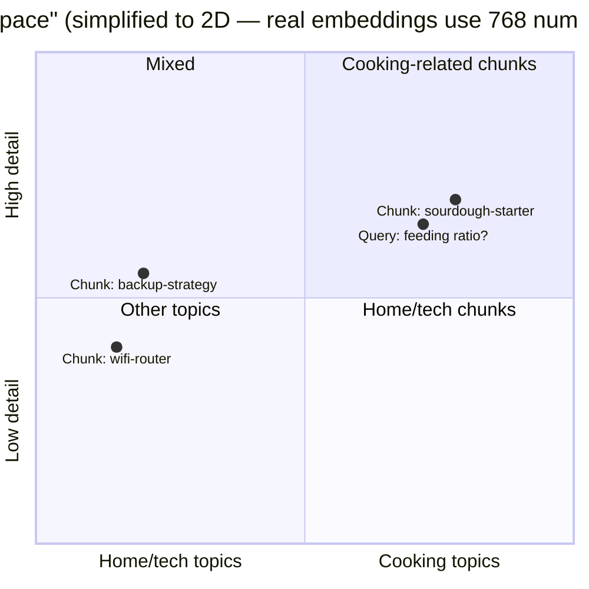
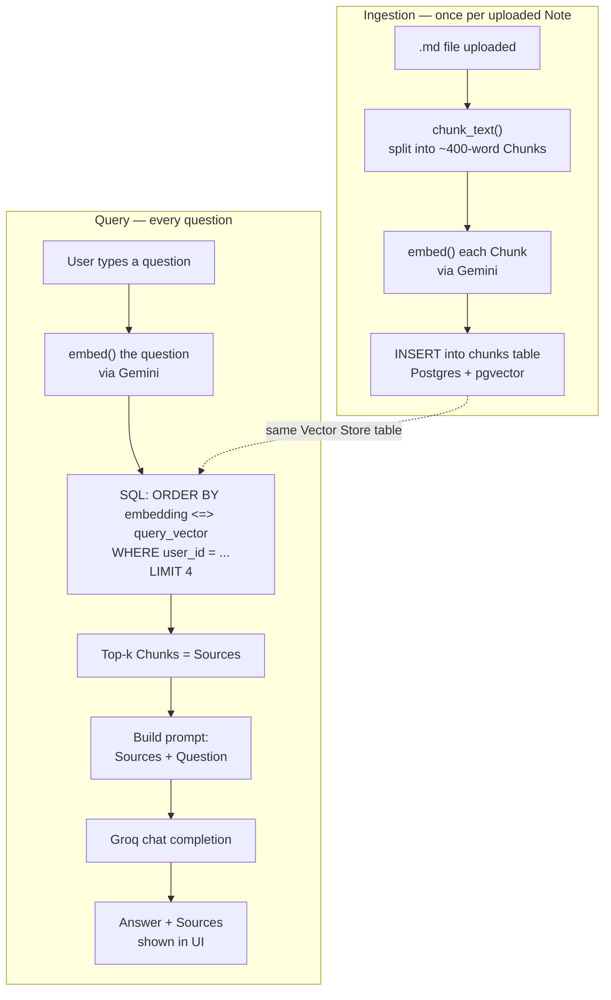
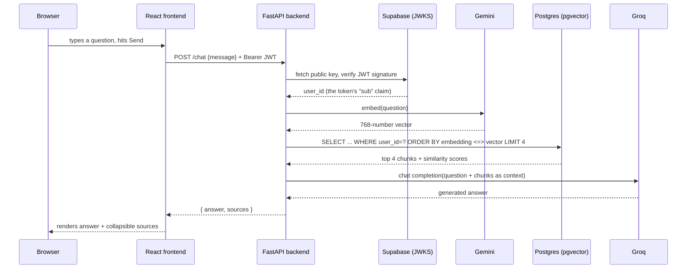
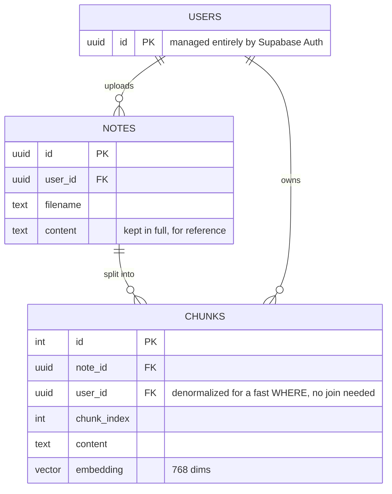

# RAG Learning Notes

Personal reference for how Ask Your Notes Bot actually works, and how RAG (Retrieval-Augmented Generation) works in general. Written against the code as it exists after the cloud/multi-user rewrite (Groq + Gemini + Supabase).

## 1. The big idea

An LLM only knows two things: whatever it learned during training, and whatever text you put in its prompt right now. It has never seen your personal notes. Two bad options exist if you want it to answer questions about them:

- **Stuff everything into the prompt.** Works for a handful of short notes, falls apart once your notes exceed the model's context window — and even within the limit, LLMs get measurably worse at using information buried in the middle of a huge prompt ("lost in the middle").
- **Fine-tune a model on your notes.** Expensive, slow to update (re-train every time you add a note), and massive overkill for a personal notes bot.

RAG is the third option: keep the notes in an external store, and at question time, **search** for the few pieces of text most relevant to the question, and paste **only those** into the prompt. The model never needs to "know" your notes — it just reads the relevant excerpt you hand it, the same way you'd paste a paragraph into a search engine and ask "does this answer my question?"

This is why the system prompt in `rag.py:answer()` says *"Answer using only the notes below"* — the model is explicitly being told to reason over the retrieved text, not its own training data. That instruction is what keeps answers grounded and reduces hallucination (the model confidently making things up): it's much harder to hallucinate when you're told to quote from a specific passage than when you're asked an open-ended question.

## 2. Visualizing the embedding space

An embedding model turns text into a list of numbers — 768 of them, here — such that similar *meaning* ends up as nearby *points*. Real embeddings live in 768-dimensional space, which nobody can picture, but the intuition holds even flattened to two dimensions:

The query "what feeding ratio do I use?" lands almost on top of the sourdough chunk and far from the wifi/backup chunks — that geometric closeness *is* the retrieval mechanism. `ORDER BY embedding <=> query_vector LIMIT 4` is just "sort every chunk by distance to this point, take the closest few." There's no keyword matching involved at all, which is why a question phrased completely differently from the note's wording ("how much flour do I add" vs. the note's "feeding ratio") can still retrieve correctly — the *meaning* is close even when the *words* aren't.

## 3. Two separate pipelines

RAG systems always split into two independent flows that run at completely different times:

| | **Ingestion** (write path) | **Query** (read path) |
|---|---|---|
| When | Once, when a Note is uploaded | Every time a question is asked |
| Input | A Note's raw text | A Query (the user's question) |
| Output | Rows in the Vector Store | An Answer + Sources |

They only share one thing: both turn text into an **Embedding** using the *same* embedding model, so the numbers are comparable to each other later — that's exactly the shared space visualized above.

## 4. Ingestion, step by step

Code: `backend/main.py:upload_note()`, `backend/rag.py`

1. **Upload arrives.** The React `Chat.jsx` sends the `.md` file as `multipart/form-data` to `POST /notes`, with the user's Supabase access token in the `Authorization` header.
2. **Auth check.** `Depends(get_current_user_id)` (in `auth.py`) verifies the JWT and extracts `user_id` before the endpoint body even runs — see §7.
3. **Chunking** (`rag.py:chunk_text`, lines 16-30). The raw text is split on blank lines into paragraphs, then packed into chunks of up to 400 words. When adding the next paragraph would overflow, the current chunk is closed, and the *last 50 words of it* are carried over to seed the next chunk — that's the overlap. A fact sitting right at a chunk boundary still has surrounding context in at least one chunk, instead of being cut in half with no context on either side.
4. **Embedding, per chunk** (`rag.py:embed`, lines 33-39). Each chunk's text is sent to Gemini's `gemini-embedding-001` model, which returns a list of 768 floating-point numbers — the chunk's position in "meaning space" (§2).
5. **Storage** (`main.py:upload_note`, `db.py`). The note's full text is saved once in the `notes` table (so you always have the original); each chunk is saved as a row in `chunks`, with its embedding stored in a `vector(768)` column (a `pgvector` type that Postgres can do math on directly) and a `user_id` column that ties it to whoever uploaded it.

## 5. Query, step by step

Code: `backend/main.py:chat()`

1. **Question arrives** as `POST /chat`, again with the user's access token.
2. **Embed the question** using the exact same `embed()` function and model as ingestion. This is what makes retrieval possible at all: the question's embedding and the chunks' embeddings live in the same space, so "distance" between them means something.
3. **Similarity search**, right inside Postgres — the `WHERE c.user_id = %s` clause is the entire multi-tenancy enforcement (§6); remove that one line and every user's notes would leak into every other user's search results. `ORDER BY ... LIMIT %s` is what makes this **top-k retrieval**: we don't want *all* matching chunks, just the `TOP_K = 4` closest ones.
4. **The retrieved chunks become Sources.** They're returned to the frontend for display *and* used to build the prompt — same data, two jobs.
5. **Prompt assembly & generation** (`rag.py:answer`, lines 46-56). The sources are concatenated with a header per chunk (`[filename #index]`) and wrapped in an instruction telling the model to answer only from that text. This whole string, plus the original question, goes to Groq's `openai/gpt-oss-120b` as one user message. Whatever text comes back is the Answer.

## 6. Data model & multi-tenancy

Multi-tenancy — many users sharing one system while their data stays isolated — is implemented here as cheaply as it gets: a `user_id` column, checked in a `WHERE` clause on every query. `user_id` is stored on `chunks` directly (not just reachable via `note_id → notes.user_id`) specifically so the hot-path retrieval query in §5 can filter with no join at all. There's no per-tenant database, no row-level security policy (yet) — just application code that never forgets to add that `WHERE`. That's also the biggest risk in this design: the isolation guarantee lives in every query being written correctly, not in something the database enforces on its own.

**JWT (JSON Web Token) / JWKS** — The access token Supabase issues after login is a signed JWT containing the user's id in its `sub` claim (that's the `A-->>B: user_id` step in the sequence diagram above). `auth.py` verifies the signature against Supabase's public keys (fetched from its JWKS endpoint) before trusting anything in the token — this is what stops someone from just making up a `user_id` and reading other people's notes.

## 7. Key terminology

**Embedding** — A list of numbers (768 of them here) representing a piece of text's meaning. Produced by a dedicated embedding model, not a chat model.

**Chunk** — A slice of a document, sized to be small enough to embed meaningfully and retrieve precisely, but large enough to contain a complete thought. Chunk size is a real tuning knob: too small and you lose context ("1:5:5" without "feeding ratio" nearby means nothing); too big and irrelevant text dilutes the embedding, hurting retrieval precision.

**Vector Store / Vector Database** — Storage that can answer "which of these million vectors is closest to this one?" efficiently. Here it's just a Postgres table with a `vector` column via the `pgvector` extension — no separate specialized database needed at this scale.

**Cosine similarity / distance** — The standard way to compare two embeddings: it measures the *angle* between them as vectors, ignoring magnitude. `pgvector`'s `<=>` operator computes cosine distance directly in SQL.

**Top-k retrieval** — Retrieve only the `k` most similar chunks (here, `k=4`), not everything above some threshold. Simple, predictable, and it's what keeps the prompt small.

**Grounding** — Giving a model real source text and instructing it to answer from that text specifically, rather than from its own training data. RAG's entire value proposition is grounding.

**Hallucination** — An LLM stating something false with full confidence, because generation is fundamentally "predict plausible next words," not "look up true facts." Grounding via RAG reduces this a lot but doesn't eliminate it — the model can still misread a correctly retrieved source.

**Context window** — The maximum amount of text a model can consider at once (prompt + generated answer combined). RAG exists partly because context windows are finite and get worse at attention over their full length even before hitting that limit.

## 8. Why two different AI providers

Groq (chat) and Gemini (embeddings) are different services because Groq doesn't offer an embedding model at all — it only serves chat/completion models, optimized for very fast inference on its custom hardware. Gemini was picked for embeddings because it has a well-documented free tier and a `gemini-embedding-001` model with a configurable output size (truncated to 768 dimensions here — smaller vectors, less storage, per Google's own docs, "without losing quality").

Both the chat model *and* the embedding model must be network calls now (not local Ollama) because the backend runs on a server, which can't reach a model running on your laptop. See `docs/adr/0002-hosted-multi-tenant-cloud-architecture.md`.

## 9. What's deliberately not built (and why that's fine)

- **No conversation memory** (`docs/adr/0001`) — every Query is answered standalone. A real product would feed recent chat history into the prompt too, but that's a second, separable problem from "does basic retrieval work."
- **Notes are append-only** (`docs/adr/0003`) — no edit/delete yet. Removing a note would mean deleting its chunk rows and re-checking nothing else referenced them; not built because it doesn't block the core loop.
- **No hybrid search / reranking** — retrieval here is pure vector similarity. A more advanced RAG system might combine this with old-fashioned keyword search (catches exact terms embeddings can miss, like part numbers or names) or add a reranking model pass over the top candidates before generation.

## 10. File map

| File | Role |
|---|---|
| `backend/rag.py` | Chunking, embedding, and answer-generation logic — the actual "RAG" part |
| `backend/db.py` | Connects to Postgres, creates the `notes`/`chunks` tables and `pgvector` extension |
| `backend/auth.py` | Verifies the Supabase JWT, returns the calling user's id |
| `backend/main.py` | FastAPI routes: `/notes` (ingestion) and `/chat` (query) |
| `frontend/src/Chat.jsx` | Upload UI + chat UI + renders Sources per answer |
| `CONTEXT.md` | Canonical definitions of every domain term (Note, Chunk, Query, etc.) |
| `docs/adr/` | Why things are built this way, for decisions that would be surprising otherwise |

## 11. Ideas for continuing to learn

- Change `chunk_size`/`overlap` in `rag.py` and re-upload a note — watch how the Sources returned for the same question change.
- Print the `score` values for a deliberately unrelated question — see how low similarity looks compared to a relevant one (we saw `0.83` for a matching note vs `~0.30` for unrelated ones in testing).
- Try a hybrid approach: add a plain `ILIKE '%keyword%'` SQL filter alongside the vector search and compare results.
- Add a reranking step: retrieve top 10 by vector similarity, then have a cheap model re-score just those 10 before picking the final top 4.
